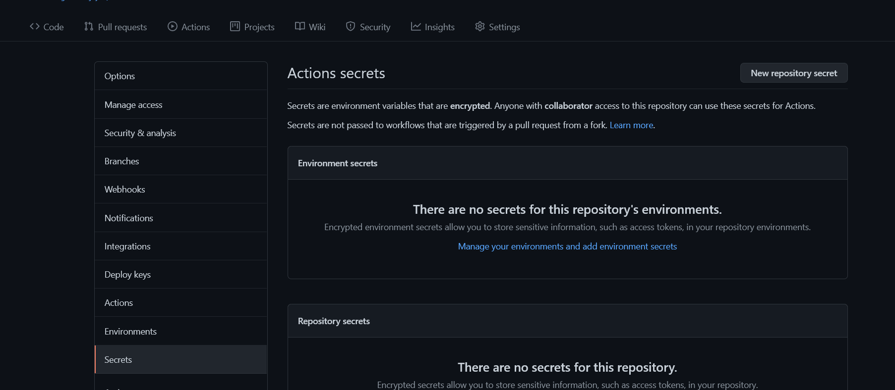
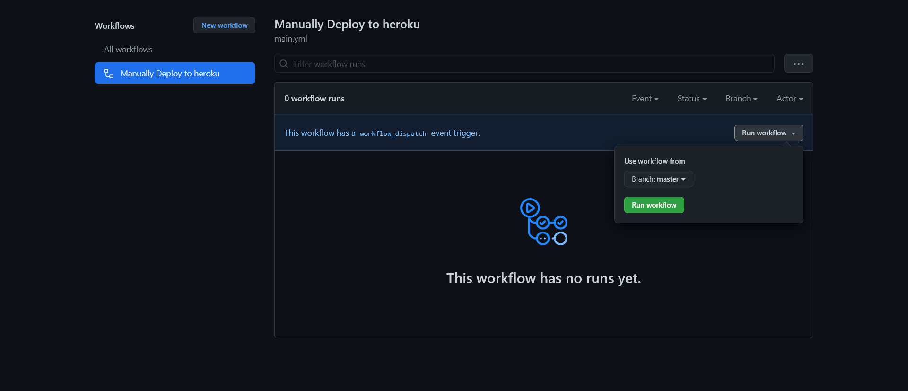

<h1>TorToolkit Manually Deploy via Heroku X Github Actions</h1>
<h3>This page will tell you how to deploy TorToolkit  to heroku without suspension on Github Actions</h3>

> Do not overuse it, or your account might be banned by Heroku.
> This is Not for abusers at all
> Dont abuse github actions...lets stay under the radar..

### 👉Pre Requisites
1️⃣ [Heroku Account](https://heroku.com) --- **mostly importantly needed for heroku api key and deployment**

2️⃣ [Rclone Config](https://rclone.com) --- **Not Mandatory**  **but if you want the files to be uploaded to cloud you will need rclone config**

3️⃣ [Telegram Account](https://telegram.org) --- **mostly importantly needed for the bot to work** 

4️⃣ [Some Patience](https://www.google.com/search?q=how+to+be+more+patient)

### Deployment instructions,Some Recomendations and Notes🤗

🔷 **Here I Don't Provide any Deploy button to heroku, We Use Github Actions to Deploy container to Heroku**

🔷 **It is Reconmended to use any DC-4/DC-2 bot token and Heroku Deployment Region should be EU... **❓why I am saying that?**  **In order to get High Upload Speed In telegram Leech Upload it is recomended** **you will get about 20MiB/s in TG upload which is equal to 200mbps and in normal DC-1/DC-5 bot you will get 5MiB/s which is equal to 50Mbps😆**
   > **To get DC-4 token (i will make bot with your own username and name and transfer its ownership to you via botfather) CONTACT `@XCODERSHUB` FOR MORE...**
 
🔷 **Make sure to Set the vars correctly in Github-Actions** ❌Dont edit/delete any ENV vars from heroku or Dont add any new vars from heroku either...
   > **to edit/add/del ENV vars...Simply go to github actions and rerun the workflow**

🔷 **If you edit any file or Stuff from Git-Repo you will have to RE-RUN the workflow again or else you will face no changes LOL** 

#### Steps

🎈1. **Fork this Repo**

🎈2. **Go to Repository `Settings` -> `Secrets`**
    
    
🎈3. **Now set the below Variables in the Github Repository Secrets**
    [Environmental Variables](#environment-variables)

🎈4. **After filling the Required vars .... go to Actions and then tap on Run the Workflow**
    

🎉5. **now wait it for it to deployed to heroku and Check app logs and Turn on Workers If OFF** **if everything is OK then send /help to the bot or try other cmds**... **fun fact Bot has No Response to /help cmds**

## Environment Variables

### 🔴Required Environmental Variables... MUST BE GIVEN.... This Required ENV var is for Heroku Deployment only

| Variable | Value | Example | Required | Description |
| :---: | :---: | :---: | :---: | :---: |
| HEROKU_EMAIL | Heroku email | abc@abc.com | True | Just Give the email you used for Heroku Account|
| HEROKU_API_KEY | Heroku API key | xxxxxxx-xxxx-xxxx-xxxx-xxxxxx | True | Get it from [Heroku](https://dashboard.heroku.com/account/applications/authorizations/new) |
| HEROKU_APP_NAME | Heroku app name | Name Must be unique | True | Heroku app name that needs to be Updated or Created (Should be in lowercase) |
| BOT_TOKEN | Telegram Bot Token | your telegram bot api key/token | True | Create a bot using [@BotFather](https://telegram.dog/BotFather), and get the  API token. |
| API_ID | Telegram API_ID | Your TG account's API_ID | True | Get this value from [TELEGRAM](https://my.telegram.org/apps). |
| API_HASH | Telegram API_HASH | Your TG account's API_HASH | True | Get this value from [TELEGRAM](https://my.telegram.org/apps). |
| OWNER_ID | TG account's ID | Your TG account's ID | True | ID of the bot owner, He/she can be abled to access bot in bot only mode too(private mode). |
| ALD_USR | Authorized Chats | Your Group Chats ID + admins/owners id | True | Create a Super Group in Telegram, add `@missrose_bot` to the group, and send /id in the chat, to get this value. you can aswell add owner id/add by 1 space for some extra permissions.... |
| BASE_URL_OF_BOT | Heroku App name web url | https://appname.herokuapp.com  | True | put entire appname url from `Heroku_APP_NAME` note: - the app doesnt need to be created just in `appname` above replace the name you gave in `HEROKU_APP_NAME`.... |

## note:- the Postgres "DATABASE_URL" var will need to be added manually after deployment is done....go to https://elements.heroku.com/addons/heroku-postgresql and add it to your deployed app or else bot will crash and wont work..

### [Not Required Environment Variables..Click Here..](readme.md#optional-vars)
> **IF YOU WANT TO SET optional vars then go to your deployed heroku app settings and add the vars ...**

## DONT TOUCH/EDIT ANY VARS FROM HEROKU if want to change/edit do from Github...

## IF YOU WANT TO SET optional vars then go to your deployed heroku app settings and add the vars ...
